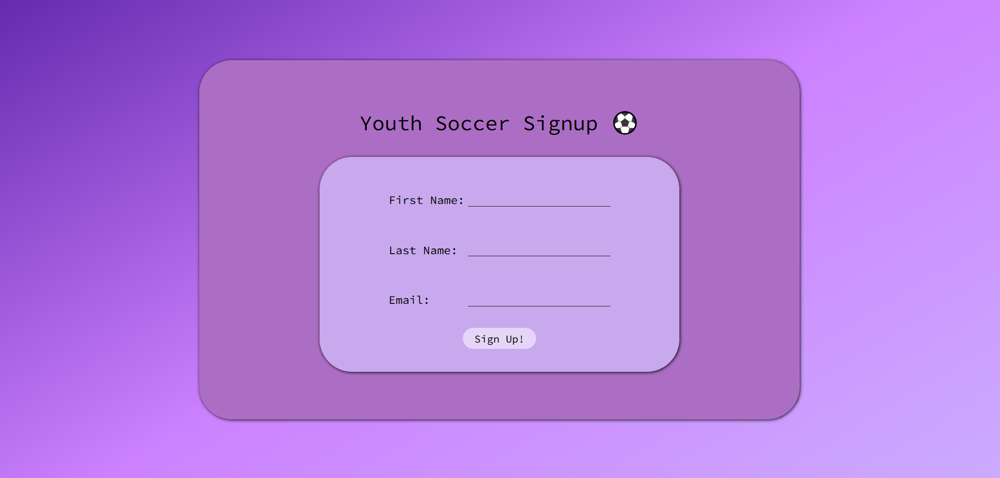
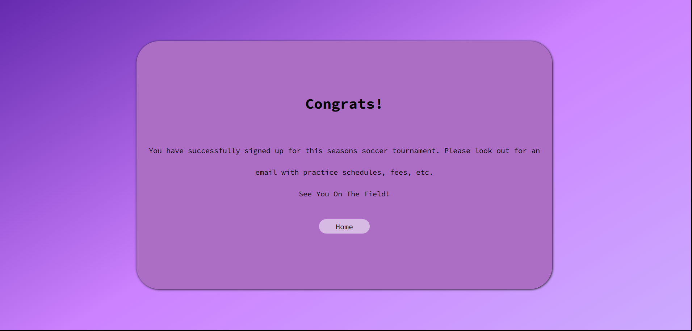

# Youth Soccer Signup

## Overview:

This project is a youth soccer signup application that allows users to enter personal information and
register for a fictional soccer league. It was built with Node.js, HTML, CSS, and JavaScript to practice
handling HTTP requests, serving static files, processing form submissions, and building a simple multi-page
application without using a framework.

## Features:

- Accepts player registration information through a signup form.
- Validates required fields before completing registration.
- Displays a success page after a valid submission.
- Displays an error page when required information is missing.
- Server multiple HTML pages from a Node.js server.
- Loads separate CSS stylesheets for each page.
- Writes player information to a JSON data file.

## Tech Stack:

- Node.js
- JavaScript
- HTML5
- CSS3

## Installation and Running the Project:

1. Clone the repository.
2. Open the project folder.
3. Make sure Node.js is installed.
4. Start the server.
5. Open the local URL in the browser.

## Application Routes

- `GET /signup` - Displays the signup form.
- `POST /signup` - Processes the submitted registration information.

## What I Learned

- I realized that every stylesheet is its own HTTP request, which helped me understand why static assets
  need their own routes.
- I recognized what parts of an application should be handled by the front end technologies versus the back end tachnologies
  and why that separation improves design scalability, flexibility, maintainability and performance.
- I learned how to use a JSON file as a simple mock database in order to store user information received from
  the POST request.
- I used flexbox to organize the layout and make the page adapt more naturally to different screen sizes.
- I recognized where OOP concepts, particularly abstraction and encapsulation, appeared in the project by organizing
  implementation details into separate modules that are not relevant to the user's interaction with the application.

## Future Improvements:

- Add a selection field with age group options.
- Add a checkbox that the user checks as additional verification that all information is correct.
- Add a select field with t-shirt sizes.
- Replace JSON file with MongoDB database.

## Screenshots:

### Signup Page

### Success Page

### Error Page

